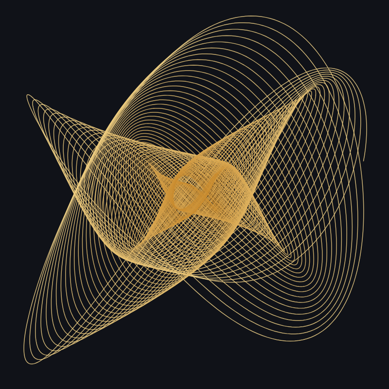

# Harmonograph

See musical intervals drawn by pendulums. Pick a ratio, from the octave (1:2) and the fifth (2:3) to the whole tone (8:9), set the phase, detune and damping, and watch the pen draw a harmonograph figure or a Lissajous curve. Listen to the two pendulums as two tones, and save the drawing as an SVG or a PNG. No sign-up and no libraries.

- [Draw a harmonograph](https://evoluteur.github.io/harmonograph/)

## What it does

A harmonograph draws with pendulums: one swings the pen from side to side, another up and down. When their speeds are in a simple ratio, the same ratios that sound consonant in music, the drawing closes on itself in a simple, regular figure.

- **Interval**: harmonograph or Lissajous, ten musical intervals (unison, octave, fifth, fourth, major and minor thirds, major and minor sixths, whole tone, twelfth), or any ratio from 1 to 12 for each pendulum.
- **Pendulums**: phase, detune (a small mismatch that makes the figure turn), and for the harmonograph damping, a rotary pendulum with its speed, and the swing time. **Surprise me** picks random settings.
- **Watch and listen**: **Draw it** traces the figure the way the pen would, **Turn the phase** animates it, and **Listen** plays the two pendulums as two tones, one in each ear, at the same ratio.
- **Look and save**: five color schemes (ink on paper, gold, neon, spectrum, blueprint), line width, **Download PNG** (2400 pixels square) or **Download SVG**.

## The equations

Lissajous: x = sin(2π a t + δ), y = sin(2π b t).

Harmonograph: x = e^(−dt) [sin(2π a t + δ) + m sin(2π r t + δ/2)], y = e^(−dt) [sin(2π b′ t) + m cos(2π r t + δ/2)], where b′ is b slightly detuned, d the damping, and m and r the size and speed of the rotary pendulum.

## How it is built

The pages are plain HTML, CSS and JavaScript, with no dependencies and no build step. Just open `index.html`. The sound is made with the Web Audio API. It is also a small installable web app: add it to your home screen or desktop and it works offline.

- The figures, animation, sound and export are all in [js/harmonograph.js](https://github.com/evoluteur/harmonograph/blob/main/js/harmonograph.js).
- Three color themes (dark, light and blue) are shared with my other projects.
- Your settings are kept in the browser's local storage.

Harmonograph is open source at [GitHub](https://github.com/evoluteur/harmonograph) with MIT license.

Had fun browsing the app? [Buy me a coffee by becoming a sponsor](https://github.com/sponsors/evoluteur).

You may also be interested in my other projects [Music-of-the-Spheres](https://github.com/evoluteur/music-of-the-spheres) ([demo](https://evoluteur.github.io/music-of-the-spheres/)) and [Cymatics](https://github.com/evoluteur/cymatics) ([demo](https://evoluteur.github.io/cymatics/)). For more mystic arts as small web apps, see [Esoterica](https://evoluteur.github.io/esoterica.html).

Copyright (c) 2026 [Olivier Giulieri](https://evoluteur.github.io/).
